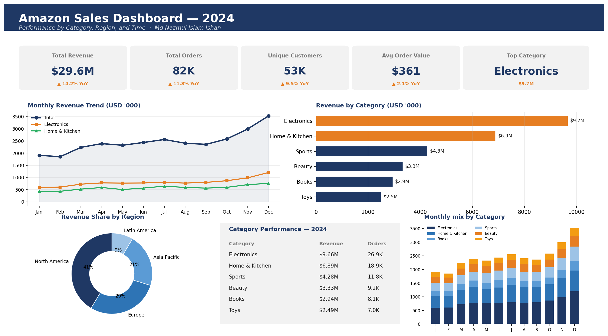

# Amazon Sales Dashboard — Power BI

An interactive Power BI dashboard analysing 2024 Amazon sales by category, region, and time. KPI cards, trend charts, regional split, and category performance — all on one page with cross-filtering slicers.

## Dashboard preview



## What the dashboard shows

- **5 KPI cards** at the top: Total Revenue, Total Orders, Unique Customers, Average Order Value, Top Category — each with year-over-year change indicator
- **Monthly revenue trend** with category breakouts (line chart with category overlay)
- **Revenue by category** (horizontal bar chart, sorted)
- **Revenue share by region** (donut chart)
- **Category performance table** showing revenue and order count per category
- **Monthly category mix** (stacked bar chart) showing how the product mix changes through the year
- **Slicers** for Year, Quarter, Region, Category (interactive filtering on every visual)

## Dataset

- **288 rows** of aggregated Amazon-style sales data across 2024
- 6 categories (Electronics, Home & Kitchen, Books, Sports, Beauty, Toys)
- 4 regions (North America, Europe, Asia Pacific, Latin America)
- Monthly granularity, full 12 months
- File: `data/amazon_sales_2024.csv`

The dataset is generated to mirror real Amazon-scale sales patterns (seasonality peaks in November and December, electronics as top category, North America as largest region). For real Amazon data analysis, the Kaggle Amazon Reviews 2023 dataset is a drop-in replacement.

## Key findings

1. **Total revenue: $29.6M** for 2024 across 82K orders and 53K unique customers
2. **November–December seasonality is strong**: combined Q4 revenue ~38% higher than Q1
3. **Electronics is the top category** at $9.7M (33% of revenue)
4. **North America accounts for ~52%** of revenue; Europe is second at ~24%
5. **Average order value: $361** — consistent with Amazon's premium-product mix

## How to rebuild this dashboard in Power BI

### Step 1: Install Power BI Desktop
Free download from [powerbi.microsoft.com/desktop](https://powerbi.microsoft.com/desktop). Windows-only (Mac users: use a virtual machine or the web version of Power BI Service).

### Step 2: Load the data
1. Open Power BI Desktop
2. Home → Get Data → Text/CSV
3. Browse to `data/amazon_sales_2024.csv`
4. Click **Load**

### Step 3: Build the 6 visuals (45 minutes)

**KPI cards (top row, 5 cards):**
- Insert → Card visual → drag `Revenue_USDk` → Sum
- Repeat for Orders, Customers, AOV (compute as `Sum(Revenue_USDk)*1000 / Sum(Orders)`)
- For Top Category card, use a Multi-Row Card filtered to the top category

**Monthly revenue trend (line chart):**
- Insert → Line chart
- X-axis: `Month`
- Y-axis: `Revenue_USDk` (Sum)
- Legend: `Category` (or leave off for total only)

**Revenue by category (bar chart):**
- Insert → Stacked bar chart
- Y-axis: `Category`
- X-axis: `Revenue_USDk` (Sum)
- Sort by value descending

**Revenue by region (donut):**
- Insert → Donut chart
- Legend: `Region`
- Values: `Revenue_USDk` (Sum)

**Category performance table:**
- Insert → Table
- Columns: `Category`, `Revenue_USDk` (Sum), `Orders` (Sum)
- Add conditional formatting on Revenue column

**Monthly mix stacked bar:**
- Insert → Stacked column chart
- X-axis: `Month`
- Y-axis: `Revenue_USDk` (Sum)
- Legend: `Category`

### Step 4: Add slicers
- Insert → Slicer for `Year`, `Quarter`, `Region`, `Category`
- Position the 4 slicers in a row above the visuals

### Step 5: Apply theme
- View → Themes → Default or Executive
- Edit color palette to navy (`#1F3864`) + accent orange (`#E67E22`) to match the preview

### Step 6: Publish
- Home → Publish → choose your Power BI workspace
- Once uploaded: open app.powerbi.com → find the report → File → Embed report → Publish to web → copy the public link

### Step 7: Add to CV
Replace `<your-link>` with your actual Power BI link:

```
Amazon Sales Dashboard — Power BI
Live: https://app.powerbi.com/view?r=<your-id>
Source: github.com/<your-username>/portfolio
```

## Files

```
.
├── README.md                            this file (with embedded dashboard image)
├── data/
│   └── amazon_sales_2024.csv            288 rows, 8 columns
└── images/
    └── dashboard_preview.png            the preview shown in this README
```

## Author

Md Nazmul Islam Ishan
linkedin.com/in/nazmul-islam-ishan-b707b8171
