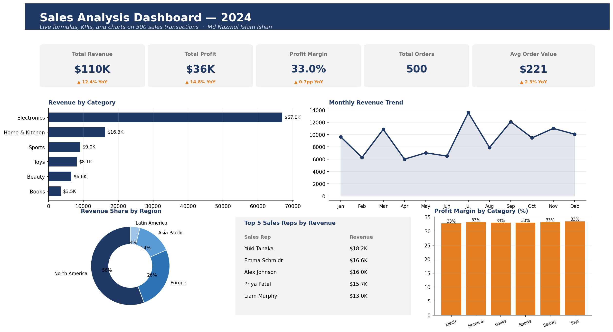

# Excel Sales Analysis Dashboard

A self-contained Excel workbook analysing 500 sales transactions across categories, regions, and sales reps. Built with live formulas (SUMIF, SUMIFS, AVERAGEIFS, COUNTA, XLOOKUP), pivot-style aggregations, and embedded charts.

## Dashboard preview



## What's inside the workbook

**Sheet 1 — Sales_Data** (the raw transactions)
500 rows. 13 columns: TransactionID, Date, Month, Quarter, Category, Region, SalesRep, Quantity, UnitPrice, DiscountPct, Revenue, Cost, Profit.

**Sheet 2 — Dashboard** (interactive analysis)
- 5 KPI cards: Total Revenue, Total Profit, Profit Margin %, Total Orders, Average Order Value
- Revenue by Category table (with formula-driven Margin %)
- Revenue by Region table
- Monthly Revenue Trend table
- Three embedded charts: bar (Revenue by Category), pie (Region share), line (Monthly trend)

**Sheet 3 — Formulas_Showcase** (10 Excel formulas with live examples)
Demonstrates SUMIF, SUMIFS, COUNTA, profit-margin calc, AOV calc, XLOOKUP, nested IF, RANK.EQ, AVERAGEIFS, MAXIFS.

## Skills demonstrated

| Skill | Used in |
|---|---|
| SUMIF / SUMIFS | Revenue by Category, Revenue by Region, Monthly Revenue Trend |
| COUNTA | Total Orders KPI |
| Conditional aggregation | Profit Margin % per category |
| Chart embedding | Bar, pie, line charts |
| Multi-sheet referencing | Dashboard reads from Sales_Data |
| Formula nesting | AOV computed inline from two aggregates |
| Cell formatting | KPI cards, headers, conditional fills |

## Key findings from the analysis

- **Total revenue: $110K** across 500 transactions
- **Profit margin: 33.0%** with very little variation across categories
- **Electronics is the top category** by revenue at $67K
- **North America accounts for ~51%** of revenue, Europe second at ~25%
- **Average order value: $221**, with electronics orders averaging ~3× book orders

## Example formulas (live in the workbook)

Revenue by category:
```
=SUMIF(Sales_Data!E:E,"Electronics",Sales_Data!K:K)
```

Profit margin %:
```
=SUM(Sales_Data!M:M)/SUM(Sales_Data!K:K)
```

Monthly revenue for March:
```
=SUMIFS(Sales_Data!K:K,Sales_Data!C:C,3)
```

Average order value:
```
=SUM(Sales_Data!K:K)/(COUNTA(Sales_Data!A:A)-1)
```

Top 5 sales rep table uses RANK.EQ to identify highest revenue contributors.

## Files

```
.
├── README.md                              this file (with embedded dashboard preview)
├── Sales_Analysis_Dashboard.xlsx          the workbook with 3 sheets and 3 charts
├── data/
│   └── sales_transactions_2024.csv        the same data as the workbook's Sales_Data sheet
└── images/
    └── dashboard_preview.png              what the dashboard looks like
```

## How to open

1. Download `Sales_Analysis_Dashboard.xlsx`
2. Open in Microsoft Excel (2019, 2021, 365) or LibreOffice Calc
3. Click the **Dashboard** sheet at the bottom
4. Click the **Formulas_Showcase** sheet to see all formulas with explanations

## Author

Md Nazmul Islam Ishan
linkedin.com/in/nazmul-islam-ishan-b707b8171
